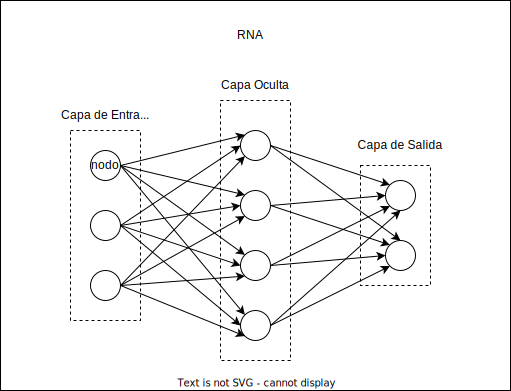

# 1. Introducción a las Redes Neuronales Artificiales

## 1.1. ¿Qué son las Redes Neuronales Artificiales?

Las Redes Neuronales Artificiales (RNA) son modelos de computación que se inspiran en la estructura y función del cerebro humano. Son fundamentales en el campo del Aprendizaje Profundo (o Deep Learning, en inglés), un subcampo de la Inteligencia Artificial.

### 1.1.1. Neuronas
En nuestro cerebro, las neuronas son las células encargadas de recibir, procesar y transmitir información a través de señales eléctricas y químicas. Una red neuronal artificial, en su esencia, intenta imitar este proceso.

**Ejemplo:** Imagina que tu cerebro es un equipo de fútbol, donde cada jugador (neurona) tiene un rol específico. Cuando se lanza el balón (información), cada jugador lo recibe, decide qué hacer con él (procesamiento), y lo pasa al siguiente jugador (transmisión). Este equipo (tu cerebro) puede mejorar su juego (aprender) con la práctica y repetición.

### 1.1.2. Modelos inspirados en el cerebro humano
Las RNA se basan en el concepto de "neurona" y buscan simular su funcionamiento. No obstante, es importante mencionar que las RNA son una simplificación de lo que realmente ocurre en nuestro cerebro.

**Ejemplo:** Siguiendo con el ejemplo del equipo de fútbol, una RNA sería un videojuego de fútbol. Aunque el videojuego intenta simular el deporte, es una simplificación del fútbol real. Del mismo modo, las RNA intentan imitar cómo funcionan las neuronas en el cerebro, pero son una versión simplificada.

### 1.1.3. Aprendizaje profundo
El Aprendizaje Profundo (o Deep Learning en inglés) es un conjunto de técnicas que permiten a las computadoras aprender directamente de ejemplos y experiencia. Las RNA juegan un papel esencial en estas técnicas.

**Ejemplo:** Imagina que estás intentando enseñarle a un niño a reconocer las formas geométricas. Podrías mostrarle varias imágenes de diferentes figuras y decirle cuál es cuál (esto es similar a enseñarle a una RNA). Con suficientes ejemplos, el niño (o la RNA) comenzará a reconocer las formas por sí mismo, sin necesidad de que se le diga cada vez.

## 1.2. Estructura y Funcionamiento de las Redes Neuronales

Las redes neuronales artificiales están organizadas en una estructura de capas de nodos, donde cada nodo simula la función de una neurona en el cerebro humano. En esta sección, nos sumergiremos en el funcionamiento y la estructura de estas redes.

### 1.2.1. Capas

Las redes neuronales se componen de al menos tres tipos de capas: capa de entrada, capas ocultas y capa de salida.

#### 1.2.1.1. Capa de entrada
Es el punto de inicio, donde se introducen los datos. Cada nodo en esta capa representa una característica de entrada.

**Ejemplo:** Imagina una red neuronal que predice el precio de una casa. Las características de entrada pueden ser el tamaño de la casa, la ubicación, la edad de la casa, etc. Cada una de estas características se introduce en un nodo diferente de la capa de entrada.

#### 1.2.1.2. Capas ocultas
Estas son las capas intermedias entre la entrada y la salida. Aquí es donde ocurre la mayor parte del cálculo. Cada nodo en estas capas realiza un cálculo y pasa el resultado a los nodos de la siguiente capa.

**Ejemplo:** Siguiendo el ejemplo anterior, las capas ocultas podrían considerar cómo las características individuales interactúan entre sí para afectar el precio de la casa.

#### 1.2.1.3. Capa de salida
Es la última capa donde se presenta el resultado final de la red neuronal.

**Ejemplo:** En nuestro ejemplo de predicción de precios de casas, la capa de salida daría el precio estimado.

### 1.2.2. Nodos

Un nodo, o neurona, en una red neuronal recibe entradas, realiza un cálculo y pasa la salida a los nodos de la siguiente capa. Cada nodo está conectado a otros nodos y tiene un peso asociado a estas conexiones.

**Ejemplo:** Piensa en los nodos como los jugadres de fútbol. Cada jugador recibe el balón (entradas), realiza una acción (realiza un cálculo) y pasa el valor al siguiente jugador (pasa la salida).

### 1.2.3. Pesos

Los pesos son valores numéricos que determinan la importancia de una entrada para un nodo. Se ajustan durante el proceso de aprendizaje de la red neuronal.

**Ejemplo:** Si volvemos al ejemplo del equipo de fútbol, los pesos serían como la habilidad de cada jugador para jugar en diferentes posiciones. Algunos jugadores pueden ser más eficaces en ciertas posiciones, y esa eficacia se ajustaría (aprendería) con la práctica y la experiencia.

### 1.2.3. Propagación hacia adelante y hacia atrás

La propagación hacia adelante y hacia atrás son dos fases del proceso de aprendizaje de una red neuronal. 

#### 1.2.3.1. Propagación hacia adelante (forward propagation)
Los datos de entrada se pasan a través de la red desde la capa de entrada hasta la capa de salida. En cada nodo, se realiza un cálculo que se basa en las entradas y los pesos de las conexiones.

**Ejemplo:** En el caso de nuestro equipo de fútbol, la propagación hacia adelante sería como pasar el balón desde el portero (capa de entrada) hasta el delantero (capa de salida), con cada jugador (nodo) realizando una acción (cálculo) con el balón (datos) basado en su posición y habilidades (pesos).

#### 1.2.3.2. Propagación hacia atrás (backpropagation)
En esta fase, la red ajusta sus pesos en función del error que ha cometido en sus predicciones. El error se calcula en la capa de salida y luego se propaga hacia atrás a través de la red, ajustando los pesos en el camino.

**Ejemplo:** En nuestro equipo de fútbol, si el delantero falla un disparo a gol, el equipo podría analizar la jugada para ver dónde se cometieron errores (cálculo del error) y cómo pueden mejorar para la próxima vez (ajustar los "pesos", es decir, la estrategia del equipo).

### 1.2.4. Función de activación

La función de activación en una red neuronal define cómo un nodo transforma sus entradas en salidas. Hay muchas funciones de activación diferentes, como la función sigmoidea, la tangente hiperbólica y la ReLU (Rectified Linear Unit), y cada una tiene diferentes características.

**Ejemplo:** Volviendo al ejemplo del equipo de fútbol, la función de activación podría ser cómo cada jugador decide qué hacer con el balón. Un jugador (nodo) puede decidir pasar (función de activación) basándose en la posición de los demás jugadores y la trayectoria del balón (entradas).

### 1.2.5. Cálculo del error

El cálculo del error es una parte crucial del aprendizaje de una red neuronal. Este proceso implica comparar las predicciones de la red con los valores verdaderos y utilizar la diferencia para ajustar los pesos de la red.

**Ejemplo:** Si un equipo de fútbol juega un partido y pierde, el entrenador podría analizar el partido y ver dónde se cometieron errores (calcular el error). Luego, el equipo puede ajustar su estrategia (pesos) para mejorar en los próximos partidos.